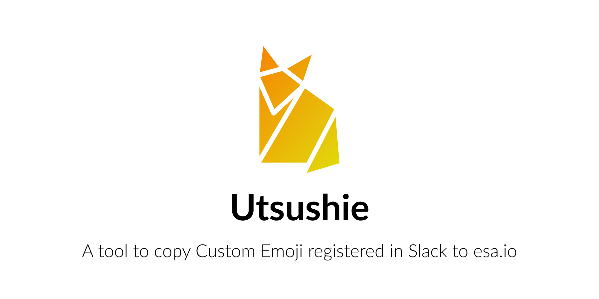

Utsushie (写し絵) はSlackに登録されているCustom Emojiをesaにコピーするツールです。なお、[esaのカスタム絵文字仕様](https://docs.esa.io/posts/226)に準拠していないCustom Emojiは無視されます。

## Usage
:warning: Slackに登録されているCustom Emojiの数によって、非常に時間がかかります。

```sh
$ bundle
$ SLACK_OAUTH_ACCESS_TOKEN='xoxp-XXXXX...' \
ESA_ACCESS_TOKEN='XXXXXX...' \
ESA_TEAM_NAME='YOUR_TEAM_NAME' \
bundle exec ruby app.rb
```

初めてこのツールを使う場合は、 `--dry-run` オプションを指定してテスト実行を行うことをおすすめします。

```sh
$ SLACK_OAUTH_ACCESS_TOKEN='xoxp-XXXXX...' \
ESA_ACCESS_TOKEN='XXXXXX...' \
ESA_TEAM_NAME='YOUR_TEAM_NAME' \
bundle exec ruby app.rb --dry-run
```

## Options

- `--dry-run` : Emojiの登録、削除、絵文字画像のDLなど、変更を行わずに動作を確認します。
- `--clean` : esaに登録されている全てのCustom Emojiを削除してからコピー処理を行います。


## ENV
下記3つのENVが必須です。

- `SLACK_OAUTH_ACCESS_TOKEN` : User tokens ( https://api.slack.com/docs/token-types#user ) を利用します。
- `ESA_ACCESS_TOKEN` : ReadとWrite権限が必要です。
- `ESA_TEAM_NAME` : `https://[ESA_TEAM_NAME].esa.io/`

## LICENSE
- [MIT](LICENSE)

## Note
Icon made by Freepik from [www.flaticon.com](https://www.flaticon.com)
